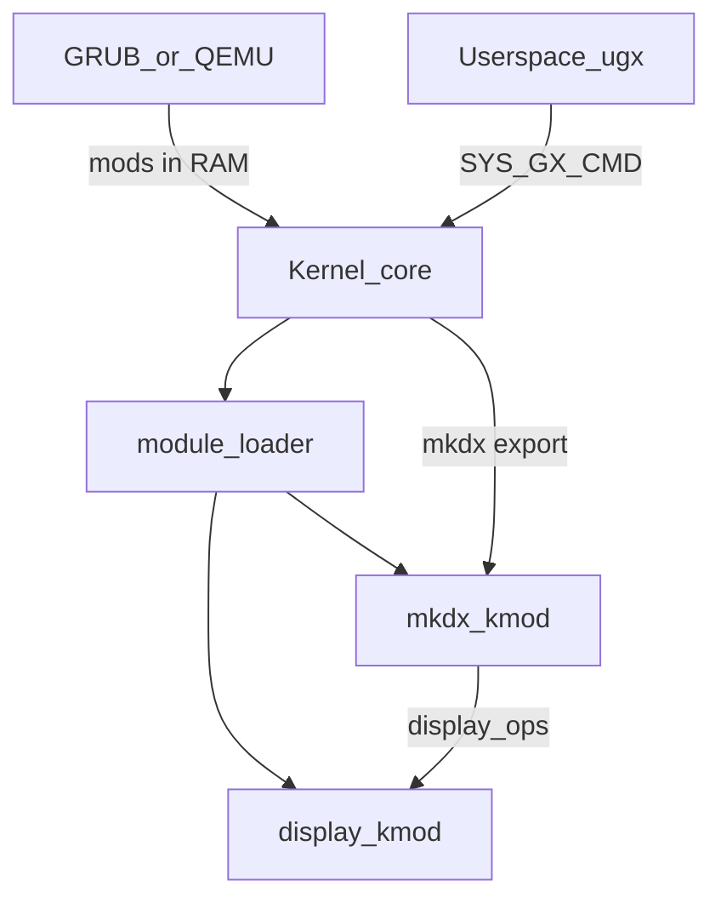

# MKDX Driver Modülleri — Core / Drivers Ayrımı

## İlke

- **`src/gfx` yok.** Grafik yığını kernel core’da yaşamaz.
- **Tek grafik API = MKDX**, `drivers/mkdx/` altında kernel driver olarak.
- **Display** = `drivers/display/` (BGA + virtio-gpu); MKDX present buraya gider.
- Driver’lar **ayrı build** (`.kmod`), **boot anında load**.
- Fail-hard; app LFB yazmaz; text VGA sadece erken log (MKDX değil).
- Dil: mevcut toolchain ile **`.h` + `.c`** (freestanding C). Header her driver’ın kendi klasöründe.

---

## File driver yok — load nasıl?

Diskten / VFS’ten `.kmod` okumak **gerekmez** ve ilk boot’ta zaten yok.

**Yol: bootloader belleğe koyar, kernel RAM’den load eder.**

```text
Build:
  kernel.bin          (core)
  display_bga.kmod
  display_virtio.kmod (veya tek display.kmod iki backend)
  mkdx.kmod

Boot (GRUB Multiboot modules veya QEMU -initrd):
  GRUB/QEMU → modülleri RAM'e yükler
  mbi->mods_count / mods_addr  (zaten [include/multiboot.h](include/multiboot.h) var)

Kernel:
  driver_framework_init()
  modules_load_from_mbi(mbi)   // ELF reloc + driver_register + init
  // hâlâ VFS / file driver yok — gerek yok
  mkdx hazır → UI
```

| Soru | Cevap |
|------|--------|
| File driver şart mı? | **Hayır** — ilk load Multiboot/initrd |
| VFS ne zaman? | Sonra; diskten runtime `driver_load("foo")` için |
| QEMU `-kernel`? | `-initrd` ile kmod blob’ları veya küçük GRUB ISO + `module` satırları |

Chicken-egg yok: **storage driver olmadan** da grafik driver boot’ta ayağa kalkar.

---

## Dizin yapısı

```text
src/kernel/          scheduler, syscall glue, VFS, heap, ...
src/drivers/
  framework/         driver.c, driver.h (veya mevcut yerinde kalır)
  pci/               pci.h, pci.c
  display/
    display.h        display_ops + get_screen_size
    bga/             bga.h, bga.c     → display_bga.kmod
    virtio_gpu/      virtio_gpu.h, .c → display_virtio.kmod
  mkdx/
    mkdx.h           public API (GetScreenSize, 2D, 3D, Present)
    *.c              compositor, context, SW/GPU render
                     → mkdx.kmod
include/user/        ugx / userspace headers (syscall ABI)
```

Ana kernel **gfx include etmez**; sadece `modules_load` + syscall’ın `mkdx_*` export tablosuna jump’ı.

---

## Mimari



**Renderer:** `mkdx.kmod` (SW 2D/3D; virtio’da GPU submit).  
**Ekrana basan:** aktif `display_*.kmod`.  
**Backend seçimi:** display modülleri probe (virtio > BGA); tek aktif.  
**App:** backend seçmez; `Present` → MKDX → display.

---

## Boot sırası (concrete)

1. `vga_init` (opsiyonel text log) + heap/GDT/IDT/syscall/VFS stub  
2. `driver_framework_init` + `pci_init` (core veya küçük pci.kmod; **pci core’da kalır** — herkes ona ihtiyaç duyar)  
3. `modules_load_from_mbi(mbi)` — sırayla `display_*.kmod`, sonra `mkdx.kmod`  
4. Display yok / mkdx yok → **-1**, UI başlamaz  
5. `user_os_ui_main` — sadece MKDX syscall  

PCI framework core’da (loadable değil): aksi halde display kmod PCI bulamaz. Input (ps2/kbd/mouse) bu planda ister core’da kalsın ister sonra kmod — grafik load’ından bağımsız.

---

## .kmod formatı (minimal)

- Relocatable ELF (`.o` benzeri) veya basit custom header + `.text/.data/.rodata` + `driver_init` sembolü.
- Export: `driver_t` kaydı (`name`, `init`, `exit`, …) — mevcut [driver.h](include/drivers/driver.h) ile uyumlu.
- Loader: sembol resolve (kernel export tablosu: `heap_*`, `pci_*`, `memcpy`, …) — ilk sürüm **sınırlı export listesi**.

İlk teslimde bile **ayrı binary** üretilir; “klasör ayrıldı ama hepsi kernel.bin’e link” kabul edilmez — gerçekten ayrı artifact + boot load.

---

## MKDX API (driver export)

- `mkdx_get_screen_size` → `display_active()->get_mode`
- 2D context: clip / mask / opacity / round
- 3D: buffer / pipeline / draw_indexed / submit  
  - BGA aktif: SW 3D → present  
  - virtio + gpu_ops: submit; fail → -1  
- `mkdx_present` → compositor → `display_ops.present`
- Acrylic: gerçek blur; stub yok

Userspace: `SYS_GX_CMD` / `ugx_*`; mkdx yüklü değilse **-1**.

---

## fb / gfx

- [src/drivers/fb.c](src/drivers/fb.c) public API + Multiboot FB yolu **silinir**; BGA kodu `drivers/display/bga/`.
- [src/gfx/](src/gfx/) **taşınır/silinir** → `drivers/mkdx/`.
- [gx_server_init](src/gfx/server.c) yerine core: modules load + `mkdx` init export.

---

## QEMU / Makefile

- `make drivers` → `build/drivers/*.kmod`
- `make run`:  
  - `qemu-system-i386 -kernel build/kernel.bin -initrd build/drivers/initrd.img`  
  - `initrd.img` = basit arşiv (magicheader + name + size + blob) veya tek concatenated kmod listesi  
- Alternatif: GRUB ISO + `module /boot/mkdx.kmod` satırları (Multiboot `mods_*`).

---

## Uygulama sırası

1. Klasör layout + pci core; gfx/fb kodunu mkdx/display altına taşı (henüz static link bile olsa yapı doğru).  
2. `.kmod` link script + `modules_load_from_mbi` / initrd parser.  
3. display bga + virtio kmod; probe; GetScreenSize.  
4. mkdx kmod (compose, clip, 3D iskelet, Present).  
5. Syscall glue; os-ui aynı ugx ile.  
6. Makefile ayrı build + initrd pack; Multiboot FB/VIDEO ihtiyacı kalkar.

---

## Bilinçli sınırlar

- İlk load **sadece** Multiboot/initrd — diskten hot-plug sonra (VFS + file driver gelince).  
- C++/hpp yok; `.h`/`.c` driver-local.  
- Virtio 3D tam VirGL sonra; önce scanout + submit iskeleti.  
- Kernel export tablosu dar tutulur (modül kernel’in her iç API’sini görmez).
