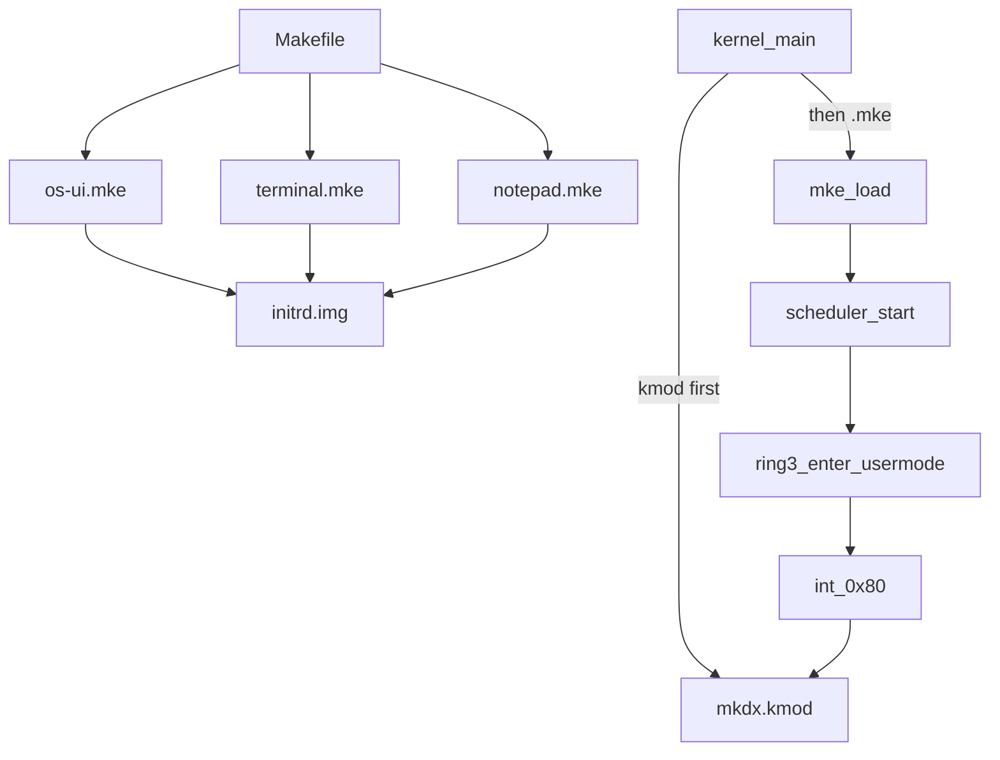

# Ring-3 `.mke` Usermode Apps

## Kararlar (sabit)

- Extension: **`.mke`** (MyKernel Executable)
- Magic: **`MKE1`** (`0x31454B4D`)
- Dağıtım: kernel.bin’e link **yok** — ayrı artifact; mevcut initrd (`IRRD`) içine `.kmod` ile birlikte pack
- Boot: `os-ui.mke`, `terminal.mke`, `notepad.mke` → her biri **ayrı ring-3 process**
- Adresleme: paging yok; her app sabit load adresi (identity map, 128M QEMU ile uyumlu)
- Grafik: sadece [`include/user/gx.h`](include/user/gx.h) + [`src/user/libgx.c`](src/user/libgx.c); kernel header yok



---

## 1) `.mke` dosya formatı

Yeni header: [`include/kernel/mke.h`](include/kernel/mke.h) (kernel loader) + mirror [`include/user/mke.h`](include/user/mke.h) (opsiyonel, build-time doc).

```c
/* packed, little-endian */
#define MKE_MAGIC   0x31454B4Du  /* 'MKE1' */
#define MKE_VERSION 1
#define MKE_NAME_MAX 32

typedef struct mke_header {
    uint32_t magic;
    uint32_t version;
    uint32_t header_size;   /* sizeof(mke_header) */
    uint32_t load_addr;     /* physical/virt identity load base */
    uint32_t entry_off;     /* entry = load_addr + entry_off */
    uint32_t image_size;    /* bytes after header (.text+.rodata+.data) */
    uint32_t bss_size;      /* zero-fill after image */
    uint32_t stack_size;    /* hint; kernel uses PROC_USTACK_SIZE */
    char     name[MKE_NAME_MAX];
} mke_header_t;
```

Dosya düzeni: `[mke_header][flat image]`. Flat image, `user.ld` ile `load_addr`’e link edilmiş i386 binary (`objcopy -O binary`).

Sabit load map:

| App | `load_addr` |
|-----|-------------|
| os-ui | `0x02000000` |
| terminal | `0x02800000` |
| notepad | `0x03000000` |

Host tool: [`tools/pack_mke.c`](tools/pack_mke.c) — ELF/`*.bin` + metadata → `.mke` (veya Makefile’da `printf`/küçük script; tercih: küçük C tool, `pack_initrd` gibi).

---

## 2) Build (Makefile)

- User kaynakları **kernel `C_SRCS` listesinden çıkarılır**.
- Yeni link script: [`user.ld`](user.ld) — parametre/variant veya app başına `USER_LDFLAGS` ile `-Ttext=$(LOAD)`.
- User CFLAGS: freestanding, `-fno-pic`, **`-DUSERMODE`**, sadece `-Iinclude` (kernel private include yok).
- Ortak user lib: `libgx.c` + minimal `user/string.c` (veya `src/lib/string.c`’nin user kopyası) — `strlen`/`memset` için `kernel/string.h` bağı kopar.
- Ürünler: `build/user/os-ui.mke`, `build/user/terminal.mke`, `build/user/notepad.mke`.
- [`tools/pack_initrd.c`](tools/pack_initrd.c): `.kmod` + `.mke` kabul; `INITRD_MAX_FILES` gerekirse artır (örn. 32).
- `run`: aynı `-initrd`, artık içinde hem driver hem app.

Her `.mke` entry: `void mke_main(void)` (export); CRT yok — entry_off = `mke_main` offset.

---

## 3) Kernel loader + process spawn

Yeni: [`src/kernel/mke.c`](src/kernel/mke.c)

1. Header doğrula (`magic`, `version`, boyutlar, `load_addr` aralık kontrolü).
2. Image’i `load_addr`’e kopyala, BSS sıfırla.
3. `process_create_user(name, (void(*)(void))(load_addr + entry_off))` — mevcut [`process.c`](src/kernel/process.c) `user_trampoline` → [`enter_usermode`](src/arch/x86/usermode.asm).

Initrd routing — [`modules_load_initrd`](src/kernel/module.c) güncelle:

- blob magic `MKE1` veya isim `*.mke` → **kmod ELF yükleme**, `mke_spawn()` / kayıt
- aksi halde mevcut relocatable `.kmod` yolu

Boot sırası ([`src/kernel/main.c`](src/kernel/main.c)):

1. Mevcut: heap, GDT, IDT, VFS, drivers, `modules_load_from_mbi` (display + mkdx)
2. `process_init()` + `scheduler_init()`
3. Initrd’deki `.mke` dosyalarını spawn et (os-ui, terminal, notepad)
4. `user_os_ui_main()` **direkt call kaldır**
5. `scheduler_start()` — dönmez

---

## 4) Ring-3 zorunlu düzeltmeler

**Syscall segment restore** — [`src/arch/x86/isr.asm`](src/arch/x86/isr.asm): handler DS/ES/FS/GS’i `0x10` yapıyor; `iret` öncesi user data `0x23` restore edilmezse ring-3 GPF. Fix şart.

**User pointer path** — [`src/kernel/syscall.c`](src/kernel/syscall.c): ugx argümanları için minimal `copy_from_user` / `copy_to_user` (şimdilik flat memcpy + null check; paging gelince aynı API).

**Yield** — her app event loop’unda `SYS_YIELD` (zaten var); preemption yok (`enter_usermode` IF kapalı).

---

## 5) App refactor (grafik uyumu)

Şu an shell, terminal/notepad’i aynı loop’ta tick ediyor ([`os-ui.c`](src/user/os-ui.c)). Ayrı process için:

- **os-ui.mke**: sadece menubar/dock; kendi `for(;;){ present; input; paint; yield; }`
- **terminal.mke** / **notepad.mke**: kendi window create/map + tick/paint loop; `app_*_open` boot’ta bir kez
- Dock tıklanınca başka process window’una erişim: MKDX’e ince API — `SYS_WM_FIND` (title → id) + mevcut `SYS_WM_FOCUS` / `SHOW`. Dock “Terminal”/“Notepad” title ile focus

User kod `#include <kernel/...>` kaldırılır; sadece `user/gx.h`, `user/apps` yerine app-local.

---

## 6) Grafik / `.mke` uyumu

- `SYS_WM_MAP` kernel surface pointer döndürmeye devam (paging yok → ring-3 yazabilir).
- Paint: `ugx_buf_*` + `ugx_damage` + `ugx_present` (mevcut sözleşme).
- İzolasyon yok (bilinçli); sonraki adım paging + gerçek mmap — bu planın dışında.

---

## 7) Plan persistence

Bu plan dosyası `.cursor/plans/` altında tutulur (mevcut `mkdx_*` / `vfs_*` planlarıyla aynı yer).
