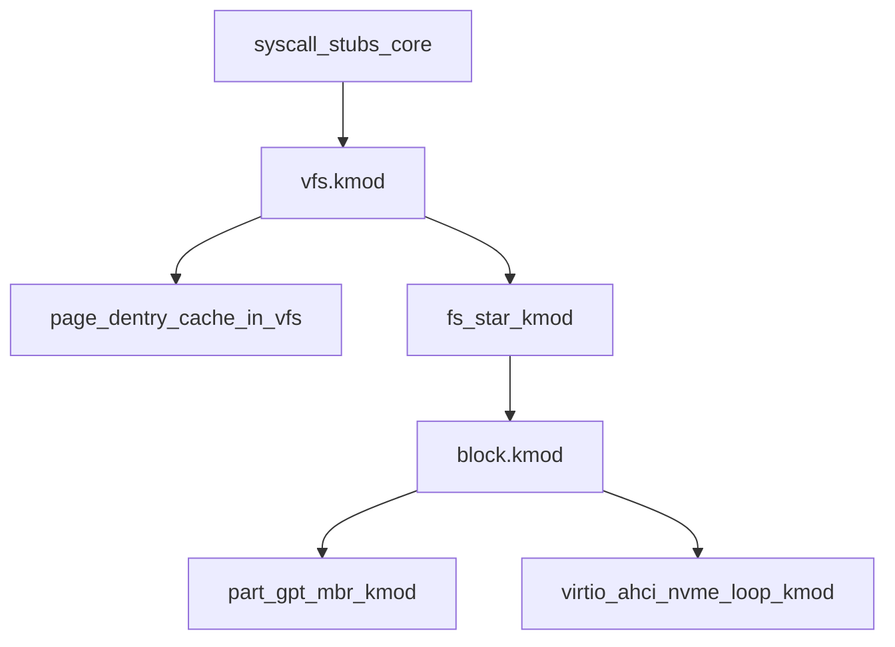

# Production VFS — Hepsi External Driver

MKDX planından bağımsız. Hedef: Linux VFS + Windows IFS’in “cool” özellik yüzeyi; **hiçbir FS/block formatı VFS içine gömülmez** — hepsi `.kmod`.

## Kritik kural

- **Format = driver.** `if (fat) ... else if (ext4)` yok. `register_filesystem("ext4", &ops)`.
- **Disk backend = driver.** virtio / AHCI / NVMe / loop ayrı kmod.
- **VFS’in kendisi de external:** `vfs.kmod` (core’da sadece module loader + syscall stub → vfs export).
- Desteklenmeyen ops: sessiz stub yok → **`-ENOTSUP` / hard fail**.
- “Tüm formatlar” = VFS’in **sınırsız eklenebilir** olması + aşağıda listelenen driver’ların her birinin ayrı kmod olarak projede yer alması (hepsi aynı `file_ops` / `inode_ops` / `super_ops` sözleşmesine bağlanır).

“Dosya formatı” burada **filesystem / volume formatı** demektir (FAT, ext4, NTFS…), PNG/PDF parser değil.

---

## Katmanlar (hepsi kmod)



| Kmod | İş |
|------|-----|
| `vfs.kmod` | inode, dentry, file, super_block, mount, path walk, cache, POSIX/Win özellik API |
| `block.kmod` | bdev, bio/request, generic_make_request |
| `part_mbr.kmod` / `part_gpt.kmod` | partition table → alt bdev |
| `virtio_blk` / `ahci` / `nvme` / `loop` / `ramdisk` | fiziksel/sanal disk backend |
| `fs_*.kmod` | her bir filesystem |

Boot: initrd → `block` + `vfs` + en az bir pseudo FS + (disk varsa) bir block backend + part + bir disk FS.

---

## VFS veri modeli (Linux uyumlu isimler)

Eski düz [vfs.c](src/kernel/vfs.c) tablosu **kalkar**. Yerine:

- **`inode`** — i_mode, i_uid/gid, i_size, i_nlink, timestamps, i_op, i_fop, i_mapping, private
- **`dentry`** — isim, parent, inode*, d_op, dcache
- **`file`** — f_pos, f_flags, f_op, private_data
- **`super_block`** — s_type, s_root, s_bdev, s_op, s_flags
- **`vfsmount` / `mount`** — mount ağacı, bind/rbind hazır API
- **`block_device`** — queue, disk boyutu, part listesi

Path walk: `path_lookup` → dcache → `inode_ops.lookup` → mount crossing.

---

## Ops sözleşmeleri (eksiksiz yüzey)

FS driver bunları doldurur; doldurmadığı slot = VFS `-ENOTSUP` (NULL çağrılmaz).

**super_operations:** `alloc_inode`, `destroy_inode`, `put_super`, `statfs`, `remount_fs`, `sync_fs`, `show_options`

**inode_operations:** `lookup`, `create`, `link`, `unlink`, `symlink`, `mkdir`, `rmdir`, `mknod`, `rename`, `setattr`, `getattr`, `listxattr`, `permission`, `get_link`

**file_operations:** `read`/`write`/`read_iter`/`write_iter`, `llseek`, `mmap`, `ioctl`/`unlocked_ioctl`, `fsync`, `flush`, `poll`, `lock`/`flock`, `fallocate`, `open`, `release`, `readdir`/`iterate`

**dentry_operations:** `d_hash`, `d_compare` (case-insensitive FS: VFAT/NTFS), `d_delete`, `d_revalidate`

**address_space_operations (page cache):** `readpage`/`readahead`, `writepage`/`writepages`, `dirty_folio`, `invalidate`

**xattr_handlers:** user/system/security/trusted (Linux); ADS benzeri named stream → xattr veya `:` stream API Windows uyumu için ayrı `stream_ops` opsiyonel slot.

Bu yüzey vfs.kmod’da **tam tanımlı**dır; “cool feature sonra ekleriz” diye ops tablosu eksik bırakılmaz.

---

## Linux + Windows özellik yüzeyi (vfs.kmod)

Hepsi VFS katmanında API olarak var; FS driver yeteneğine göre doldurur:

| Özellik | Not |
|---------|-----|
| open/read/write/lseek/close | POSIX |
| mkdir/rmdir/readdir/unlink/rename/link/symlink | dizin + link |
| stat/fstat/statfs | |
| chmod/chown/utimens (setattr) | permission modeli |
| mmap / msync | file → VM (kernel VM ile export) |
| ioctl | FS/device özel |
| flock / POSIX locks | |
| poll/select | |
| xattr get/set/list | |
| Named streams | NTFS/Win tarzı; FS ops slot |
| Case-sensitive / insensitive mount flag | d_compare |
| Sparse / fallocate | |
| sync/fsync/fdatasync | |
| mount/umount/bind/move | |
| Device nodes | mknod + devtmpfs |
| Pipe/FIFO / Unix socket vnode tipi | inode mode bits |
| inotify/fanotify tarzı watch | `fsnotify` API iskeleti + en az bir backend |
| Volume label / UUID | super + udev-benzeri |

Uid/gid + basit permission **vfs.kmod içinde** (process cred ile); ACL genişlemesi xattr üzerinde.

---

## Disk / backend driver’ları (external)

Hepsi `block.kmod`’a `register_blkdev` / `add_disk`:

- `virtio_blk.kmod` — QEMU birincil
- `ahci.kmod` / `ata_piix.kmod` — gerçekçi IDE/SATA
- `nvme.kmod`
- `loop.kmod` — dosyayı bdev yap
- `ramdisk.kmod` — test

Partition:

- `part_mbr.kmod`
- `part_gpt.kmod`  
Probe sırası: GPT → MBR; ikisi de driver.

---

## Filesystem driver’ları (external, register)

Pseudo / sistem:

- `ramfs`, `tmpfs`, `devtmpfs`, `procfs`, `sysfs`, `initrdfs`

Disk:

- `fat` (12/16/32), `exfat`
- `ext2`, `ext3`, `ext4` (ortak `ext` ailesi + feature flag)
- `iso9660`, `udf`
- `ntfs`

Yeni format = yeni kmod + `register_filesystem`; VFS’e dokunulmaz.

İlk boot için zorunlu set (initrd): `vfs` + `block` + `ramfs`/`initrdfs` + `devtmpfs`. Diskli sistem: + `virtio_blk` + `part_gpt` + en az bir disk FS (`fat` veya `ext4`).

---

## Layout

```text
src/kernel/                 module loader, syscall → vfs_export*
src/drivers/vfs/            vfs.kmod (inode/dentry/file/mount/cache)
src/drivers/block/          block.kmod
src/drivers/block/virtio_blk/
src/drivers/block/ahci/
src/drivers/block/nvme/
src/drivers/block/loop/
src/drivers/part/mbr/
src/drivers/part/gpt/
src/drivers/fs/ramfs/
src/drivers/fs/tmpfs/
src/drivers/fs/devtmpfs/
src/drivers/fs/procfs/
src/drivers/fs/sysfs/
src/drivers/fs/initrdfs/
src/drivers/fs/fat/
src/drivers/fs/exfat/
src/drivers/fs/ext/
src/drivers/fs/iso9660/
src/drivers/fs/udf/
src/drivers/fs/ntfs/
```

Her klasör kendi `.h` + `.c`; public ABI `vfs` export + `block` export.

---

## Boot / load

```text
1) Core + Multiboot/initrd
2) Load vfs.kmod, block.kmod, initrdfs/ramfs, devtmpfs
3) Mount initrd → / ; mount devtmpfs → /dev
4) Load block backends + part_* + fs_* from initrd or later from disk
5) mount /dev/vda1 / mnt type=ext4|fat|...
6) module_load_path("/lib/drivers/....kmod")
```

VFS yüklü değilken file syscall → **-1** (fail-hard).

---

## Eski kod

[include/kernel/vfs.h](include/kernel/vfs.h) / [src/kernel/vfs.c](src/kernel/vfs.c) stub **kaldırılır**; yerine core’da ince `vfs_call` indirection + `drivers/vfs`.

---

## Uygulama sırası (mimari önce, driver dalgası)

1. `vfs.kmod` — tam ops tabloları + inode/dentry/file/mount + path walk + ENOTSUP varsayılanı  
2. `block.kmod` + `ramdisk` + `loop`  
3. `part_gpt` / `part_mbr`  
4. Pseudo FS’ler (ramfs, tmpfs, devtmpfs, procfs, sysfs, initrdfs)  
5. `virtio_blk` + `fat` (RW) — QEMU disk doğrulama  
6. Page cache + dcache + xattr + flock + mmap hooks  
7. `ext` ailesi, `exfat`, `iso9660`, `udf`, `ntfs`  
8. `ahci`, `nvme`  
9. `module_load_path` + fsnotify  

Her dalgada ABI kırılmaz; yeni FS sadece register olur.

---

## MKDX ile ilişki

Grafik kmod’ları initrd ile gelebilir (VFS şart değil). Diskten load için bu VFS stack şart. Birleşme: `module_load_path`.
