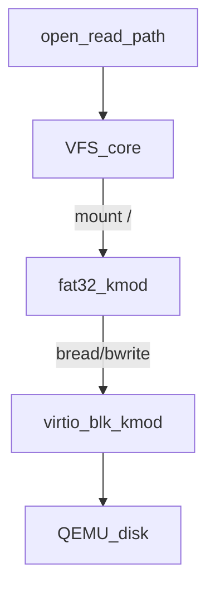

# VFS + File / Block Driver Planı

Bu plan **MKDX grafik planından ayrıdır**. Grafik kmod’ları boot’ta initrd/Multiboot ile yüklenmeye devam eder; disk/VFS olgunlaşınca *ek* olarak diskten de `driver_load` açılır.

## Öneri (net yol)

“File driver” tek parça değil — üç katman:

| Katman | Rol | Örnek |
|--------|-----|--------|
| **VFS** (kernel core) | `open/read/write/mount` tek API | genişletilmiş [vfs.h](include/kernel/vfs.h) |
| **Block driver** | Sektör oku/yaz | `drivers/block/virtio_blk` |
| **FS driver** | Dosya sistemi | `drivers/fs/fat32` |

App / `driver_load("mkdx")` sadece VFS path görür: `/lib/drivers/mkdx.kmod` → VFS → FAT → virtio-blk → disk.



**Neden virtio-blk + FAT32?** QEMU’da gerçekçi PCI block cihaz; FAT32 implementasyonu ext2’den basit; Windows/USB uyumu iyi. IDE/ATA sonra eklenebilir.

**İlk boot hâlâ initrd:** File driver olmadan MKDX load (grafik planı). VFS+disk gelince ikinci aşama: initrd’den sadece `virtio_blk` + `fat32` load → root mount → kalan kmod’lar diskten.

---

## Bugünkü durum

[include/kernel/vfs.h](include/kernel/vfs.h) / [src/kernel/vfs.c](src/kernel/vfs.c):

- Düz isim tablosu (`motd`, `dev/console`) — mount yok, dizin yok, block yok
- `vfs_register_file` = RAM’de statik blob
- Process fd mapping var ([process.c](src/kernel/process.c))

Bu **ramfs-benzeri stub**; üretim dizin ağacı değil. Üzerine mountable VFS yazılacak / değiştirilecek.

---

## Hedef VFS (core)

Core’da kalsın (her driver buna bağlanır):

```c
/* kavramsal */
vfs_mount(source, target, fstype, flags);
vfs_open / read / write / lseek / close / stat
vfs_mkdir / readdir          /* sonra */
register_filesystem(fs_type_ops);
register_block_device(bdev);
```

Yapılar:

- `vnode` / `vfs_node`: tip (file/dir/dev), ops tablosu, FS private
- `file` (open file): offset, flags, vnode*
- `mount`: root vnode + fs_ops + device
- Path walk: `/a/b/c` → mount noktaları + `lookup`

İlk mount’lar:

1. **ramfs** `/` veya `/dev` — console, null (mevcut device kaydı buraya)
2. **initrd** (opsiyonel) — boot blob’ları dosya gibi
3. **fat32** `/` veya `/mnt` — virtio-blk üzerinde

Syscall: mevcut open/read/write varsa bağla; yoksa ekle.

---

## Block driver (`drivers/block/virtio_blk/`)

Ayrı `.kmod` (veya ilk etapta initrd’den load):

- PCI virtio-blk bul, queue init
- API: `bread(dev, lba, buf)`, `bwrite(...)`, `block_size`, `capacity`
- VFS/FS sadece bu API’yi görür — ATA detayı sızmaz

QEMU: `-drive file=disk.img,if=virtio` (veya eşdeğeri).

---

## FS driver (`drivers/fs/fat32/`)

Ayrı `.kmod`:

- `filesystem_ops`: mount, lookup, read_file, (sonra write/create)
- İlk sürüm: **read-only FAT32** yeter (kmod + asset okumak için)
- Write/create ikinci faz

Mount örneği: `vfs_mount("/dev/vda", "/", "fat32", 0)` veya `/mnt/root`.

---

## File / kmod load yolu (VFS sonrası)

```text
Boot:
  1) Multiboot/initrd → virtio_blk.kmod + fat32.kmod (+ belki mkdx)
  2) block init, fat mount
  3) vfs_open("/lib/drivers/display_bga.kmod") → module_load_fd()
  4) vfs_open("/lib/drivers/mkdx.kmod") → module_load_fd()
```

`module_load_fd` / `module_load_path`: VFS’ten dosyayı RAM’e oku → mevcut ELF/.kmod loader (grafik planındaki loader ile aynı).

Böylece “file driver” = **VFS + block + FS**; ayrı sihirli bir şey değil.

---

## Aşamalar

1. **VFS core refactor** — vnode, mount, path walk, ramfs, `/dev/console` taşı; eski düz tabloyu kaldır/uyumla.
2. **initrd FS** (hafif) — boot arşivini VFS’te `/` veya `/boot` olarak gez (disk yokken kmod path testi).
3. **virtio-blk kmod** — bread/bwrite + `/dev/vda` device node.
4. **fat32 kmod read-only** — disk.img mount; `open/read` gerçek dosya.
5. **module_load_path** — diskten `.kmod` yükle; grafik planı ile birleştir.
6. **FAT write / mkdir** — sonra.

---

## Dizin layout

```text
src/kernel/vfs/          vfs core (mount, path, file, ramfs)
src/drivers/block/virtio_blk/   .h .c → .kmod
src/drivers/fs/fat32/           .h .c → .kmod
```

Header’lar driver klasöründe; core sadece `vfs.h` + `blockdev.h` + `fs_register.h` export eder.

---

## MKDX planı ile ilişki

| Boot aşaması | Ne yüklenir | Nasıl |
|--------------|-------------|--------|
| Şimdi / grafik MVP | display + mkdx | initrd/Multiboot (VFS şart değil) |
| VFS MVP | virtio_blk + fat32 | initrd |
| Olgun | diğer kmod’lar | disk path via VFS |

İki plan paralel gidebilir; birleşme noktası `module_load_path`.

---

## Bilinçli sınırlar

- İlk FAT **read-only**.
- Tek block cihaz, tek mount root yeter.
- ext2/NVMe yok (sonra).
- Page cache / dcache yok — doğrudan FS read.
- Güvenlik/permission modeli yok (uid yok).
