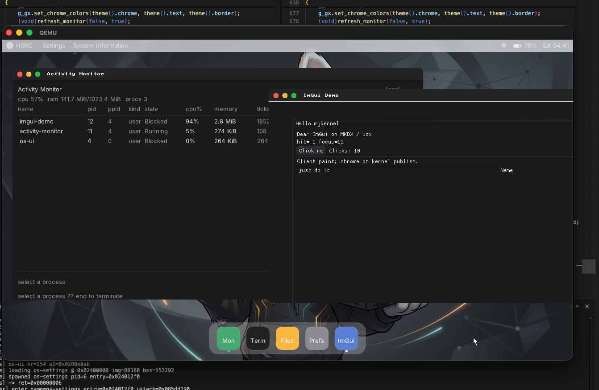
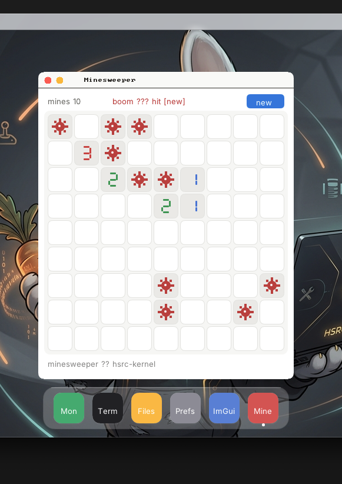

<p align="center">
  
</p>

<h1 align="center">hsrc-kernel</h1>

<p align="center"><strong>bare metal. multiboot. your own damn desktop.</strong></p>

<p align="center"><em>Hasırcıoğlu → <strong>HSRC</strong> → <code>hsrc-kernel</code>. Hobi OS — kernel'den dock'a, sıfırdan.</em></p>

i386 Multiboot kernel + loadable `.kmod` drivers + usermode C++ `.mke` apps. SMP. Virtio. A real compositor. We're not asking permission — this is the sport.

Boots. Paints windows. Runs ImGui for fun. Cool. Don't care. Doing it anyway.

---

## Showcase

Desktop in the wild. Activity Monitor flexing next to ImGui. Minesweeper because why not. Sexy and we know it.

<p align="center">
  
  &nbsp;
  
  &nbsp;
  
</p>

<p align="center"><em>Desktop · Activity + ImGui · Minesweeper</em></p>

---

## Features

Stuff that actually exists in the tree — no LinkedIn buzzwords:

- **x86 Multiboot kernel** — `i686-elf` freestanding, boots under QEMU (`qemu-system-i386`)
- **SMP** — LAPIC + APs; default run is **3 vCPUs**
- **Preemptive scheduler** — timer IRQ context-switches CPU hogs; cooperative yield still works
- **Usermode processes** — C++17 apps packed as **`.mke`**, flat address space, syscalls
- **Threading + sync** — `Thread`, kernel **Event**, **ConditionVariable** (block for real, don't spin on `yield(0)`)
- **MKDX** — window/surface compositor (layers, acrylic blur, wallpaper, drag) as a loadable module
- **Desktop stack** — `os-ui` dock/shell, terminal, files, settings, activity-monitor, **minesweeper**
- **ImGui rendering** — why not. Dear ImGui software-rasterized onto MKDX/ugx; display present is SW (BGA) or VirtIO-GPU scanout via PCI. Demo: `apps/imgui-demo`
- **Driver modules (`.kmod`)** — packed into initrd; PCI, VGA, PS/2, VFS/block stack, …
- **Virtio** — `virtio-blk` disk + `virtio-net` + DHCP / sockets
- **VFS zoo** — fat, ext, ntfs, exfat, iso9660, tmpfs, procfs, sysfs, and friends (as loadable FS drivers)
- **Boot splash** — because staring at serial alone is for cowards

---

## Architecture peek

```
┌─────────────────────────────────────────────────────────┐
│  usermode .mke apps                                     │
│  os-ui · terminal · files · settings · activity · imgui │
│  C++ SDK: gfx / thread / Event / CV / fs / net          │
└──────────────────────────┬──────────────────────────────┘
                           │ syscalls
┌──────────────────────────▼──────────────────────────────┐
│  kernel                                                 │
│  process · scheduler · SMP · sync · VFS · net · mm      │
└──────────────────────────┬──────────────────────────────┘
                           │ .kmod / initrd
┌──────────────────────────▼──────────────────────────────┐
│  drivers                                                │
│  MKDX compositor · virtio · block/fs · input · display  │
└─────────────────────────────────────────────────────────┘
```

Graphics rule of thumb: **kernel owns windows & present; apps own pixels.** MKDX composes; SDK commits. Present is BGA/LFB (software) **or** VirtIO-GPU scanout — PCI/`display_ops` picks, apps don't. Chrome on the kernel. Client paint on MKDX/ugx. No "draw a button in ring 0" nonsense.

---

## ImGui rendering

ImGui rendering? Sexy and we know it.

Why not. Dear ImGui runs as a normal usermode `.mke` app — custom `imgui_impl_ugx` software-rasterizes draw lists into the window's MKDX/ugx client surface (under OS chrome), then the compositor presents. Not Vulkan. Not OpenGL. Pixels through ugx like any other app. Cool. Don't care. This is the sport.

**Display backend — SW *or* GPU scanout. Apps don't pick.** PCI decides. `display_active()` / presence wins:

- **Software** — BGA / LFB. CPU compose + present. Classic. Reliable. Pixels the hard way.
- **GPU** — VirtIO-GPU on PCI probe. 2D scanout via `display_ops`, auto-selected by priority. Not a 3D ImGui shader backend — scanout flex only. Today.

Compositor and apps stay on ugx either way. Backend swaps underfoot. Same paint path upstairs.

```
apps/imgui-demo/     # Dear ImGui + imgui_impl_ugx on MKDX/ugx
```

Open it from the dock after `make run`. Theme follows system settings. Flex optional. Results mandatory.

---

## Build & Run

**Toolchain:** `nasm`, `i686-elf-gcc` / `g++`, `qemu-system-i386`

```bash
make            # kernel.bin + initrd + disk.img (parallel by default)
make run        # QEMU: 1G RAM, -smp 3, virtio disk+net, serial on stdio
make clean
make disk       # (re)build disk image helpers as needed
```

Serial goes to your terminal. GUI is the VGA window. Smash apps from the dock.

Override parallelism if you want: `make JOBS=1`.

---

## Project layout

```
apps/           # imgui-demo — Dear ImGui on MKDX/ugx (software render)
assets/         # fonts, wallpaper, icons, showcase shots
include/        # kernel + user SDK headers
mk/             # Makefile fragments (kernel, drivers, userapps, qemu)
src/arch/x86/   # GDT/IDT/IRQ/CPU
src/kernel/     # boot, mm, process, scheduler, SMP, sync, syscall, …
src/drivers/    # .kmod sources (MKDX, virtio, VFS, …)
src/user/       # SDK + usermode apps (.mke)
tools/          # pack_initrd, pack_mke, mkfatimg, …
```

---

## Status

Hobby OS. Sharp edges, late-night commits, occasional "wait that actually works?" moments. Contributions welcome if you like pain and pixels in equal measure.

No root license file yet — treat it as a personal/hobby project unless one shows up.
